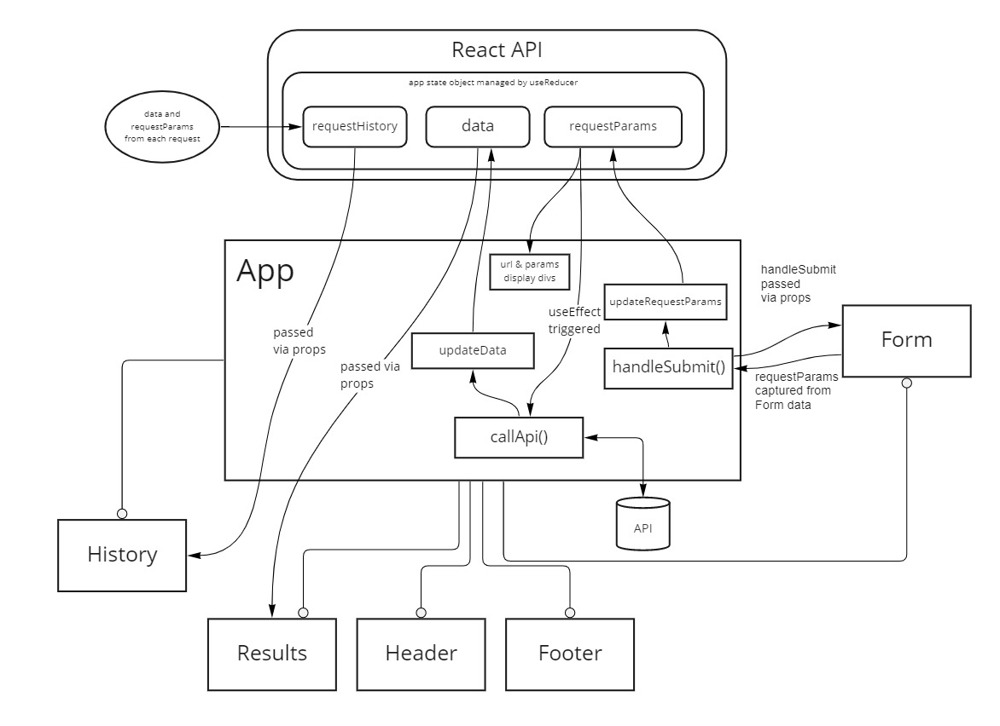
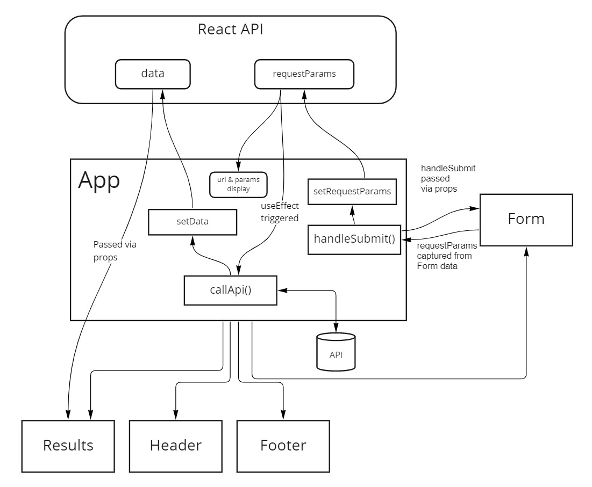
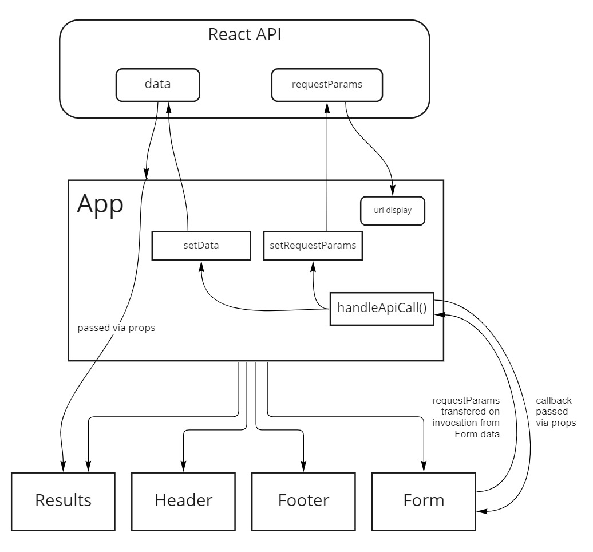
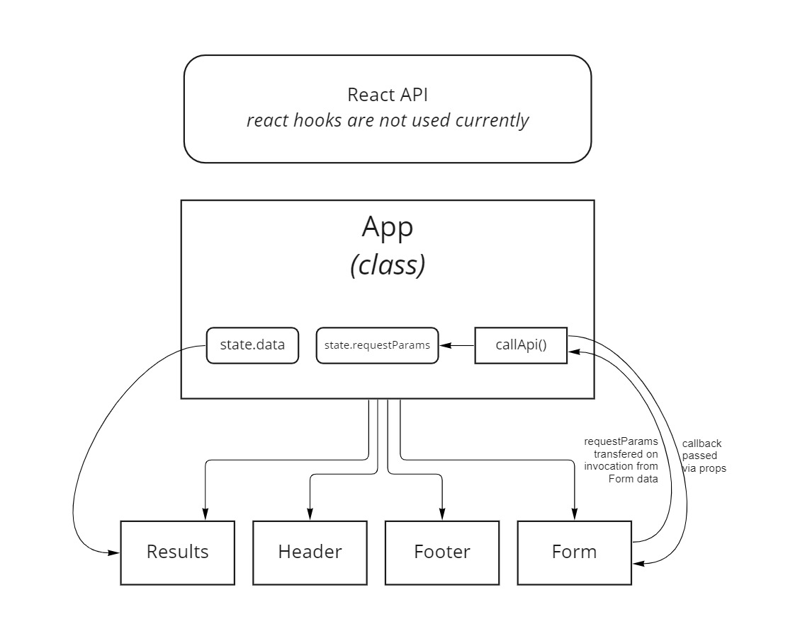

# RESTy

My first JS 401 React app. This React-based testing tool provides a web-based interface for running common-method API requests.

## [Deployed Site](https://jeffreyjtech.github.io/resty/)

## Current UML (Lab 29)

## Author

Jeffrey Jenkins

## Credits

- Used the [RJV component](https://www.npmjs.com/package/react-json-view) from npm to display pretty JSON.

## Previous UMLs

### Lab 28

### Lab 27

### Lab 26

